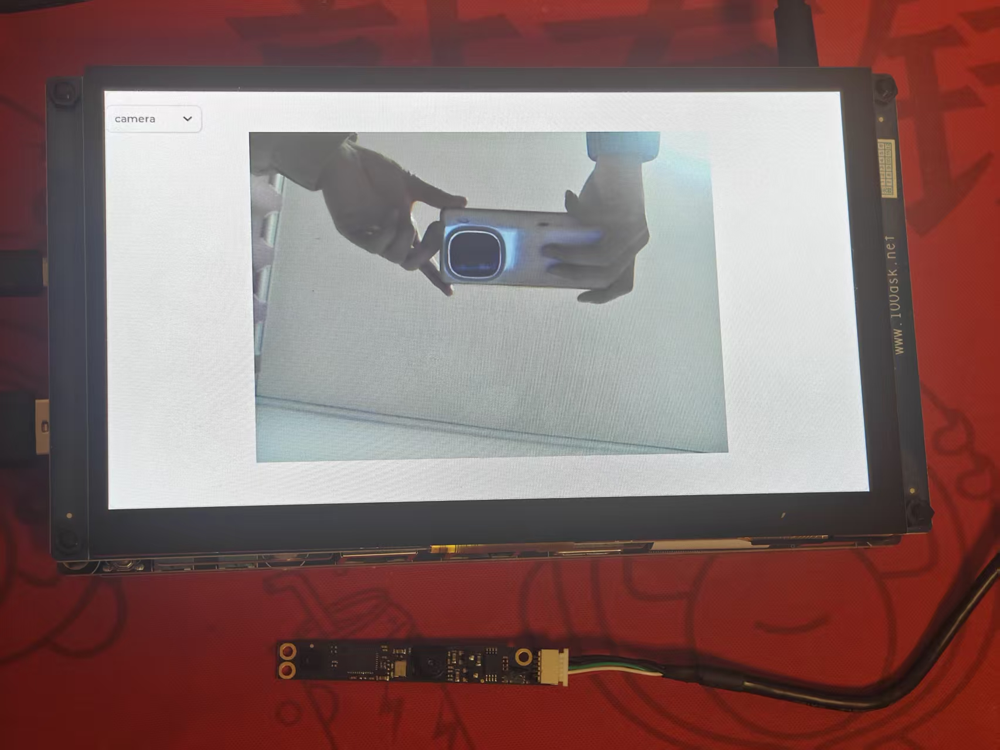
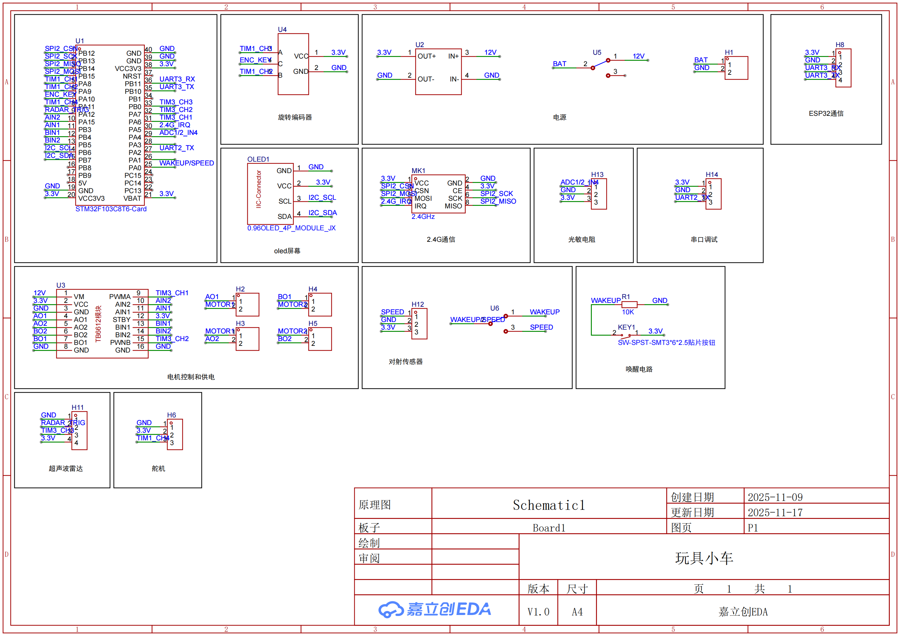
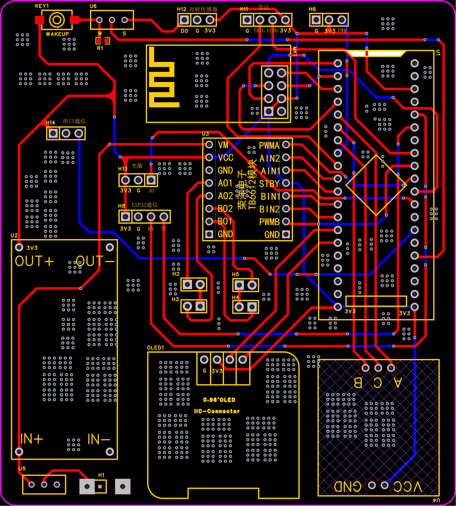

# 基于 i.MX6ULL 与 STM32 的 AIoT 远程视频监控小车系统

## 项目简介

本项目是一个集成了嵌入式 Linux 上位机与 STM32 实时控制系统的完整 AIoT 项目，是集**音视频采集、编码推流、分段录制、本地回放与远程控制于一体**的综合终端。项目旨在实现远程视频监控与设备控制，**涵盖了从硬件 PCB 设计到嵌入式 Linux 应用开发、RTOS 移植及网络通信的全栈技术**。

系统主要分为两部分：

1. **上位机 (Host)**：基于 i.MX6ULL 运行 Linux，运行 LVGL 图形界面，集成了摄像头视频流采集与分发（**本地显示/UDP传输/RTMP推流**），下位机通信。实现了多进程协同工作与守护进程监控。
2. **下位机 (Client)**：基于 STM32F103运行 FreeRTOS，负责运动控制、传感器数据采集及 OLED 本地菜单交互，通过 ESP32 联网实现远程控制。

两者通过 MQTT 协议进行远程通信，实现控制指令下发与状态数据上报。

<!-- 建议在此处放置一张项目整体实物图（小车+上位机屏幕） -->


## 系统架构与技术栈

### 嵌入式 Linux 上位机 (i.MX6ULL)

上位机软件采用多进程架构设计，各模块解耦，通过 IPC 机制协同工作，所有模块均使用 CMake 构建。

**开发环境**：Ubuntu, ffmpeg,mosquitto,nginx,CMake,交叉 gcc

- 多媒体子系统架构设计：
  
  - 采用多进程架构设计系统，包含**视频采集进程、UI 交互进程、MQTT网络通信进程及守护进程**，各模块间通过posix信号量与共享内存进行高效同步与通信。
  
  - 基于V4L2和ALSA接口封装音视频采集模块，实现 YUV 图像与 PCM 音频的实时抓取。
  
  - **修改LVGL的lv_ffmpeg源码，实现播放器功能。**
  
  - 设计**生产者-消费者**模型，使用队列配合互斥锁与条件变量，解决采集线程与编码线程间的数据速率不匹配问题，防止丢帧。

- FFmpeg 音视频数据保存与推流：
  
  - **本地录制**：以MOV格式（MJPEG/PCM）将音视频显示到屏幕并分段保存至 TF 卡，解决长时间录制的存储风险。
  
  - **网络推流**：实现 H.264/AAC 软编码，支持 RTMP 推流至 Nginx 服务器（VLC 拉流）及 UDP 点对点推流至 PC 端（FFplay 播放）。

- **全功能媒体播放器开发**：
  
  - 实现从 TF 卡读取音视频文件的完整播放器逻辑。
  
  - 音视频同步：以音频时钟为基准，通过计算 PTS差值动态调整视频渲染时机，解决音画不同步问题。
  
  - 播放控制：**实现了进度条拖动、倍速播放及暂停/恢复功能。**

- GUI 与系统集成：
  
  - **移植 LVGL 图形库**，优化 Framebuffer 刷新机制，设计多页面、多点触控 UI，实时显示摄像头预览画面。
  
  - 设计 MQTT 通信模块，将小车控制指令（Json格式）下发至下位机，并实时解析回传的传感器数据。

### 下位机控制系统 (STM32)

下位机基于 FreeRTOS 实时操作系统，保证了任务调度的实时性。

* **核心技术**：FreeRTOS, HAL 库, I2C/UART 通信，编码器接口。
* **网络模块**：ESP32 (AT 指令模式)，负责 Wi-Fi 连接与 MQTT 封包透传。
* **交互界面**：0.96寸 OLED 屏幕 + 旋转编码器，实现了多级菜单系统，可脱离上位机独立配置参数。
* **传感器与控制**：
  * HC-SR04 超声波测距
  * 光电对射传感器测速
  * 直流电机驱动

### 硬件设计

项目包含自主设计的原理图与 PCB。

* **EDA 工具**：嘉立创EDA(专业版)
* **主要板载资源**：STM32 主控, 电源管理模块, 电机驱动模块, 传感器接口，2.4g通信模块等。

---

## 核心功能展示

### 视频流传输模式

上位机 GUI 支持动态切换三种视频数据链路，体现了对网络协议和多媒体流的处理能力：

1. **本地显示**：视频帧通过共享内存直接渲染至 LVGL 控件，储存到tf卡中。
2. **UDP 局域网透传**：通过ffmpeg将视频帧点对点发送至 PC 端上位机软件。
3. **RTMP 远程推流**：调用 ffmpeg将视频推流至 Nginx 服务器，PC 端使用 VLC 拉流观看。

<!-- 在此处放置 i.MX6ULL 屏幕截图，展示 LVGL 界面和视频画面 -->



### 播放器模式

支持暂停、拉进度、倍速播放


### 小车控制与交互

* **OLED 多级菜单**：设计了通用的菜单框架，通过旋转编码器实现了参数设置、模式切换等功能。
* **运动控制**：实现了全向移动逻辑，支持上位机和本地菜单双重调速。

<!-- 在此处放置小车 OLED 菜单特写图或动图 -->

---

## 硬件设计文件

本项目的硬件电路（原理图及 PCB）均为自主设计与绘制。

### 原理图

<!-- 放置原理图截图 -->



### PCB 布局

<!-- 放置 PCB 2D 或 3D 渲染图 -->



---

### 代码结构（仓库目录）

```text
/ (repo root)
├─ imx6ull_camera/          # 摄像头采集与帧写入（共享内存）
├─ imx6ull_lvgl/            # LVGL 界面程序（多点触控 + 摄像头下拉选择）
├─ imx6ull_mqtt/            # MQTT 客户端（命令/状态交换）
├─ imx6ull_daemon/          # 守护进程（监控 LVGL 和 MQTT 等）
├─ stm32_car/               # STM32 端代码（FreeRTOS + HAL）
├─ images/                  #图片资源
└─ README.md
```

## 快速开始 | Quick Start

### 上位机编译 (i.MX6ULL)

1. 配置交叉编译环境 (Source SDK)。

2. 进入各模块目录进行编译：
   
   ```bash
   # 以 LVGL 模块为例
   cd imx6ull_lvgl/build/
   cmake ..
   make
   ```

3. 运行守护进程启动系统：
   
   ```bash
   ./imx6ull_daemon
   ```

### 下位机烧录 (STM32)

1. 使用 Keil/STM32CubeIDE 打开工程。
2. 配置为ST-link
3. 编译并下载至 STM32。
